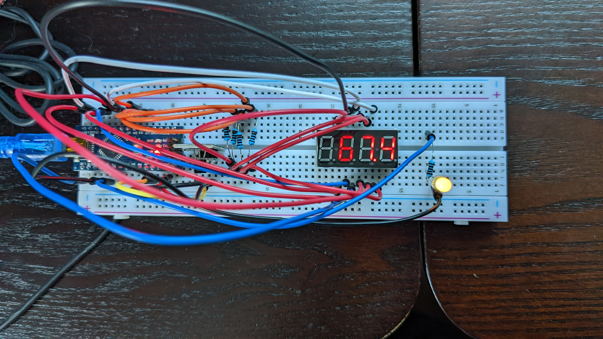

# arduino-sensors
Repo for some weekend projects with the end goal of making a weather station. Included in Resources folder is code provided with Kuman K5 Arduino sensor kit used as reference.

# Project 1: 
## Arduino Nano and a DS1820 digital temperature sensor display on a seven-segment display
Project location: ./SevenSegmentTemperature/
Project type: arduino sketch
Main: SevenSegmentTemperature.ino

Uses a rudimentary task loop system with three tasks: 
* heartbeat LED task - on A1 (used as a digital output to a 1kOhm resistor and an LED)
* Digital Temperature read task - Uses A0 (as a Digital for 9600 baud serial via OneWire library), 5V and GND
* Seven Segment Display task - uses 34611BS-1 four digit seven segment display on D2 through D13 with 1kOhm current limiters on the four digit control pins

